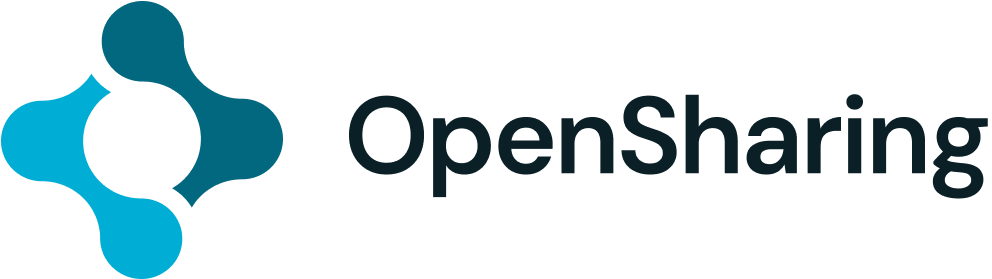
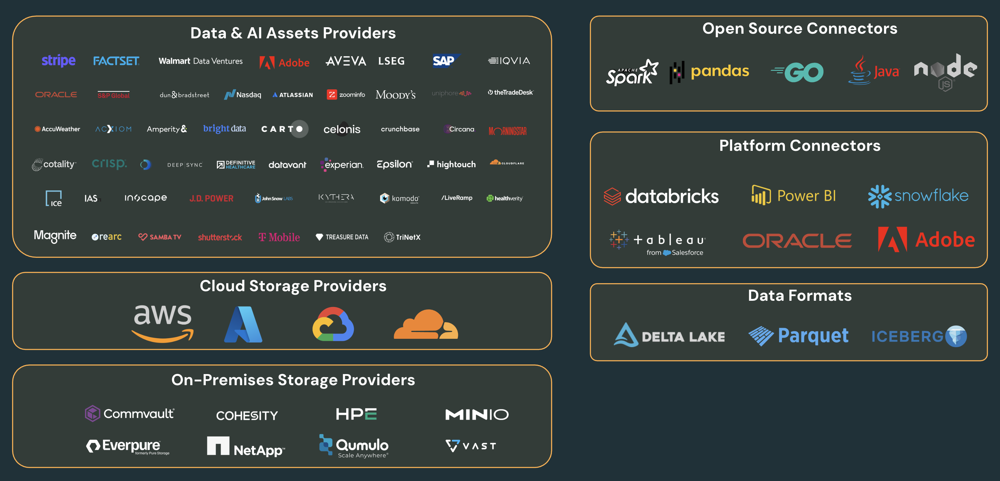

<div align="center">
  <picture>
    <source media="(prefers-color-scheme: dark)" srcset="./assets/logo-dark-mode.png">
    <source media="(prefers-color-scheme: light)" srcset="./assets/logo-original.png">
    
  </picture>
  <br><br>
  <strong>The open sharing protocol for the agentic era.</strong>
  <br><br>
  <a href="https://lfaidata.foundation">A Linux Foundation AI &amp; Data Project</a>
</div>

---

## Why OpenSharing

Enterprises across all industries need to collaborate with external organizations on Data and AI assets to derive joint value. Examples include a retailer collaborating with their suppliers on supply chain optimization, a life sciences company collaborating with healthcare providers on clinical trials, a financial data provider providing data and AI assets to their client banks for risk management, or an enterprise accessing its own assets across business units and platforms. Today, this process often requires custom point-to-point integrations, manual asset copies and transfers, and overall a high level of friction.

OpenSharing defines a cross-platform, vendor-neutral protocol for secure zero-copy sharing of Data and AI assets. Customers can use a consistent set of discovery API, credential vending model, and access controls across tables, volumes, ML models, and agent skills. Any compliant client on any platform can consume any asset type without format-specific or platform-specific code - breaking down silos and enabling open collaboration. 

Four properties across all asset types that are important for the open agentic era:

- **Open standard** — Apache 2.0, governed by the Linux Foundation. Any compliant server or client is valid — no required SDK or platform.
- **AI-native** — covers the full range of assets organizations share today, from structured tables to models and agent skills, with more on the roadmap.
- **Zero-copy** — assets stay in the provider's storage. The sharing server vends temporary, scoped credentials; recipients read directly from the source.
- **Works where data lives** — works with cloud storage like S3, ADLS, GCS, R2, and on-premises environments. Organizations that can't move data can still share it.

OpenSharing is adopted across a broad ecosystem of data providers, storage platforms, and clients:



---

## The Protocol

### Asset Hierarchy

OpenSharing uses a three-level hierarchy:

```
Share
 └── Schema
       ├── Table
       ├── Volume
       ├── AgentSkill
       ├── Model
       ├── Agent (community proposal)
       └── Page (community proposal)
```

**Share** — A named, access-controlled collection of assets granted to one or more recipients. A single credential grants access to everything within a share.

**Schema** — A logical namespace grouping related assets within a share.

**Asset** — The data or AI artifact being shared. OpenSharing defines a set of standard asset types, each with its own metadata model and access API.

### Asset Types

| Asset Type | Status | Description |
|---|---|---|
| **Table** | Specified | Structured data in [Delta Lake](https://delta.io/), [Apache Iceberg](https://iceberg.apache.org/), and Parquet formats. |
| **Volume** | Specified | A directory of files of any format — documents, media, embeddings, raw data. Access via scoped temporary cloud credentials. |
| **AgentSkill** | Specified | Reusable AI agent capabilities following the [AgentSkills specification](https://agentskills.io/specification). Each skill is a self-contained asset with its own storage location and scoped credentials. |
| **Model** | Specified | ML model artifacts with version metadata, run provenance, and credential-vended access to artifact storage. |
| **Agent** | Community proposal | Live, callable agent services. Unlike AgentSkills, a shared agent is a service the provider operates — the recipient invokes it and receives results without accessing the underlying storage or model. |
| **Page** | Community proposal | A named business entity, metric, dimension, or term — with a markdown definition and relationships to other pages in the same schema. |

---

## How It Works

### For Providers

A provider creates a **share**, adds assets (tables, volumes, models, or skills), and issues credentials to recipients. Assets are never copied — recipients access them directly from the provider's cloud storage via short-lived, scoped credentials.

```
POST /shares/{share}/schemas/{schema}/tables/{table}/temporary-table-credentials
→ returns AWS STS / Azure SAS / GCP OAuth / R2 token scoped to that table's storage location
```

### For Recipients

A recipient authenticates with a bearer token and uses standard list/get/read APIs to discover and consume assets. The same client can consume tables as DataFrames, download volume files, load model artifacts, or enumerate available agent skills — all through a unified protocol. Besides using bearer tokens, clients and servers can support other auth mechanisms such as OAuth.

```
GET /shares
GET /shares/{share}/schemas
GET /shares/{share}/schemas/{schema}/tables
GET /shares/{share}/all-tables
GET /shares/{share}/schemas/{schema}/volumes
GET /shares/{share}/schemas/{schema}/skills
GET /shares/{share}/all-skills
GET /shares/{share}/schemas/{schema}/models
```

### Zero-Copy Credential Vending

OpenSharing uses **credential vending** for secure, zero-copy access. The sharing server issues either **pre-signed URLs** or **temporary cloud credentials** (e.g. AWS STS, Azure SAS, GCP OAuth, Cloudflare R2), depending on the asset type and access mode. Recipients access assets directly from the provider's storage — the sharing server is never in the data path.

Each asset type has its own credential endpoint:

- `POST .../tables/{table}/temporary-table-credentials`
- `POST .../volumes/{volume}/temporary-volume-credentials`
- `POST .../models/{model}/versions/{version}/temporary-model-credentials`
- `POST .../skills/{skill}/temporary-skill-credentials`

---

## Specifications

The protocol is defined as a set of markdown specifications in the [`spec/`](./spec/) directory:

| Spec | Description |
|---|---|
| [`spec/protocols/OVERVIEW.md`](./spec/protocols/OVERVIEW.md) | Protocol overview, authentication, and common patterns |
| [`spec/protocols/SHARES.md`](./spec/protocols/SHARES.md) | Share object and list/get APIs |
| [`spec/protocols/SCHEMAS.md`](./spec/protocols/SCHEMAS.md) | Schema object and list API |
| [`spec/protocols/TABLES.md`](./spec/protocols/TABLES.md) | Table asset type specification |
| [`spec/protocols/VOLUMES.md`](./spec/protocols/VOLUMES.md) | Volume asset type specification |
| [`spec/protocols/AGENT_SKILLS.md`](./spec/protocols/AGENT_SKILLS.md) | AgentSkill asset type specification |
| [`spec/protocols/ML_MODELS.md`](./spec/protocols/ML_MODELS.md) | Model asset type specification |
| [`spec/protocols/AGENTS.md`](./spec/protocols/AGENTS.md) | Agent asset type specification (community proposal) |
| [`spec/protocols/GLOSSARY.md`](./spec/protocols/GLOSSARY.md) | Page asset type specification (community proposal) |
| [`spec/protocols/CREDENTIALS.md`](./spec/protocols/CREDENTIALS.md) | Shared credential model definitions |

---

## Connectors

OpenSharing is a superset of Delta Sharing. All existing Delta Sharing clients are compatible with OpenSharing.

> **Note:** All connectors currently support Table sharing. Support for Volumes, Models, and Agent Skills is in progress.

### Python Connector

The Python connector allows you to load shared tables as pandas DataFrames or Apache Spark DataFrames. Install via pip:

```bash
pip install delta-sharing
```

See the [Python connector documentation](https://github.com/delta-io/delta-sharing#python-connector) for usage.

### Apache Spark Connector

The Apache Spark connector supports SQL, Python, Java, Scala, and R, and integrates with Spark Structured Streaming for incremental data processing.

See the [Apache Spark connector documentation](https://github.com/delta-io/delta-sharing#apache-spark-connector) for usage.

### Ecosystem Connectors

<table>
<tr>
<th>Connector</th>
<th>Link</th>
<th>Status</th>
<th>Supported Features</th>
</tr>
<tr>
<td>Tableau</td>
<td>

[Tableau Exchange](https://exchange.tableau.com/en-us/products/1019)
</td>
<td>Released</td>
<td>QueryTableVersion<br>QueryTableMetadata<br>QueryTableLatestSnapshot</td>
</tr>
<tr>
<td>Power BI</td>
<td>

[Microsoft Learn](https://learn.microsoft.com/en-us/power-query/connectors/delta-sharing)
</td>
<td>Released</td>
<td>QueryTableVersion<br>QueryTableMetadata<br>QueryTableLatestSnapshot</td>
</tr>
<tr>
<td>Snowflake</td>
<td>

[Snowflake Docs](https://docs.snowflake.com/en/user-guide/tables-iceberg-configure-catalog-integration-delta-sharing)
</td>
<td>Released</td>
<td>QueryTableVersion<br>QueryTableMetadata<br>QueryTableLatestSnapshot</td>
</tr>
<tr>
<td>Oracle</td>
<td>

[Oracle Docs](https://docs.oracle.com/en-us/iaas/autonomous-database-serverless/doc/adp-consume-share.html)
</td>
<td>Released</td>
<td>QueryTableVersion<br>QueryTableMetadata<br>QueryTableLatestSnapshot</td>
</tr>
<tr>
<td>DuckDB</td>
<td>

[duck_delta_share](https://duckdb.org/community_extensions/extensions/duck_delta_share)
</td>
<td>Released</td>
<td>QueryTableVersion<br>QueryTableMetadata<br>QueryTableLatestSnapshot</td>
</tr>
<tr>
<td>Clojure</td>
<td>

[amperity/delta-sharing-client-clj](https://github.com/amperity/delta-sharing-client-clj)
</td>
<td>Released</td>
<td>QueryTableVersion<br>QueryTableMetadata<br>QueryTableLatestSnapshot<br>QueryTableChanges(CDF)<br>Time Travel Queries<br>Query Changes between Versions<br>Delta Format Queries<br>Limit and Predicate Pushdown</td>
</tr>
<tr>
<td>Node.js</td>
<td>

[goodwillpunning/nodejs-sharing-client](https://github.com/goodwillpunning/nodejs-sharing-client)
</td>
<td>Released</td>
<td>QueryTableVersion<br>QueryTableMetadata<br>QueryTableLatestSnapshot</td>
</tr>
<tr>
<td>Java</td>
<td>

[databrickslabs/delta-sharing-java-connector](https://github.com/databrickslabs/delta-sharing-java-connector)
</td>
<td>Released</td>
<td>QueryTableVersion<br>QueryTableMetadata<br>QueryTableLatestSnapshot</td>
</tr>
<tr>
<td>Arcuate</td>
<td>

[databrickslabs/arcuate](https://github.com/databrickslabs/arcuate)
</td>
<td>Released</td>
<td>QueryTableVersion<br>QueryTableMetadata<br>QueryTableLatestSnapshot</td>
</tr>
<tr>
<td>Rust</td>
<td>

[r3stl355/delta-sharing-rust-client](https://github.com/r3stl355/delta-sharing-rust-client)
</td>
<td>Released</td>
<td>QueryTableVersion<br>QueryTableMetadata<br>QueryTableLatestSnapshot</td>
</tr>
<tr>
<td>Go</td>
<td>

[magpierre/delta-sharing](https://github.com/magpierre/delta-sharing/tree/golangdev/golang/delta_sharing_go)
</td>
<td>Released</td>
<td>QueryTableVersion<br>QueryTableMetadata<br>QueryTableLatestSnapshot</td>
</tr>
<tr>
<td>C++</td>
<td>

[magpierre/delta-sharing](https://github.com/magpierre/delta-sharing/tree/cppdev/cpp/DeltaSharingClient)
</td>
<td>Released</td>
<td>QueryTableMetadata<br>QueryTableLatestSnapshot</td>
</tr>
<tr>
<td>R</td>
<td>

[zacdav-db/delta-sharing-r](https://github.com/zacdav-db/delta-sharing-r)
</td>
<td>Released</td>
<td>QueryTableVersion<br>QueryTableMetadata<br>QueryTableLatestSnapshot</td>
</tr>
<tr>
<td>Google Spreadsheet</td>
<td>

[delta-incubator/delta-sharing-connectors](https://github.com/delta-incubator/delta-sharing-connectors/tree/main/google_workspace_add_on)
</td>
<td>Beta</td>
<td>QueryTableVersion<br>QueryTableMetadata<br>QueryTableLatestSnapshot</td>
</tr>
<tr>
<td>Airflow</td>
<td>

[apache/airflow](https://github.com/apache/airflow/pull/22692)
</td>
<td>Un-released</td>
<td>N/A</td>
</tr>
<tr>
<td>Excel</td>
<td>

[https://www.exponam.com/solutions/](https://www.exponam.com/solutions/)
</td>
<td>Limited release</td>
<td>N/A</td>
</tr>
<tr>
<td>Lakehouse Sharing</td>
<td>

[rajagurunath/lakehouse-sharing](https://github.com/rajagurunath/lakehouse-sharing)
</td>
<td>Preview</td>
<td>Delta Lake and Iceberg formats</td>
</tr>
</table>

---

## Community and Governance

OpenSharing is being submitted as a sandbox project under the [Linux Foundation AI & Data](https://lfaidata.foundation/) foundation. The protocol is developed in the open, and we welcome contributions, feedback, and implementations from across the data and AI ecosystem.

**How to participate:**

- **Feedback on protocol design** — Open an issue or discussion in this repository
- **Implement a server or client** — Any compliant implementation is welcome
- **Propose new asset types** — Open an issue describing the use case and asset model
- **Join the community** — [Community channels TBD]

This specification is a community proposal. Many of the AI asset types described in this document are early proposals, and we are actively soliciting input on the design choices before finalizing the spec. See [`ROADMAP.md`](./ROADMAP.md) for the current direction and open questions.

---

## License

The OpenSharing specification is licensed under [Apache 2.0](./LICENSE).
